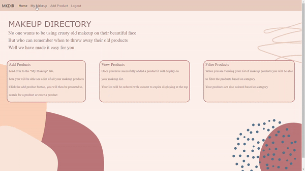

## Makeup Directory
Makeup Directory is a web application where users can track all their makeup and skincare products. Once a user enters a product the application lets the user know when to throw their product away


##Installation
clone this repository in your terminal
```bash
git clone git@github.com:micaelacolpi/Mkdir.git
```
once the repository has been cloned, type this into your terminal 
```bash
start MakeupDirectory.sln
```
this will open up Visual studio 
then click the play button on the menu at the top of the screen.
this will run the backend

Now go back to your terminal and type
```bash
npm start 
```
this will open up the application in your browser.